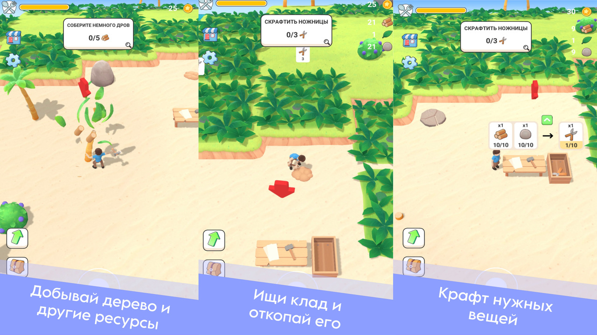
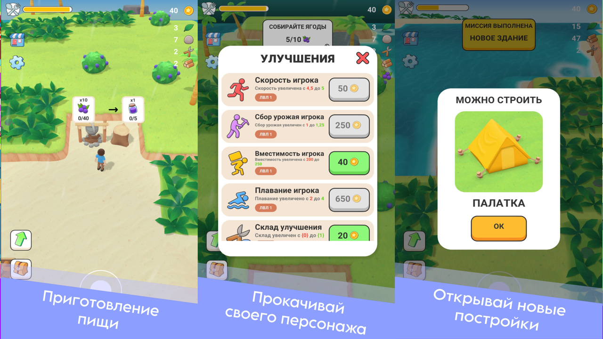

# 🏝️ Остров: Режим Выживания – построй свою базу и выживи

> Построй свою базу, исследуй мир и добывай ресурсы! Руби деревья, добывай камень, лови рыбу и находи сокровища. Строй здания, улучшай героя и нанимай помощников. Сражайся с врагами, исследуй новые локации и развивай своё поселение.  
> Пройди путь от простого выживальщика до хозяина огромного мира!

---

## 🕹️ Особенности

- Постройка базы и развитие поселения  
- Добыча ресурсов: дерево, камень, рыба, сокровища  
- Улучшение героя и найм помощников  
- Сражения с врагами и новые территории  
- Путь от выживания до господства над миром  

---

## 🔧 Платформы

- WebGL (Яндекс.Игры)  
- ПК и мобильные браузеры  

---

## 👨‍💻 Разработка

Игра сделана мной.

---

## 📸 Скриншоты

  
  

---

## 🎥 Видео

[Посмотреть геймплей на YouTube](https://youtube.com/shorts/XXXXXXXXXXX)  

---

## 📌 Статус

✅ Базовый функционал готов  
🔄 В разработке новые локации, враги и возможности  

---

## 📫 Контакты

- Telegram: [@davidmadridov](https://t.me/davidmadridov)
